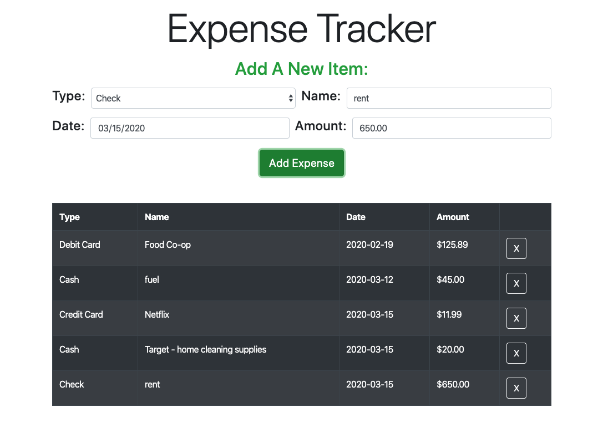

# Expense Tracker - Track Your Spending Habits (React.js, Bootstrap)

This app is a handy and simple way to keep track of how, where, when, and how much you are spending.  It was created using React Native with Bootstrap for styling.  

See my deployed version on Heroku - [HERE](https://reid-expense-tracker.herokuapp.com/) or open-source at [Github](https://github.com/ram071985/expense-tracker)


## Summary

I created this app because of my pursuit over the years to become better at keeping track of and managing my money.  Having a proper financial foundation and keeping track of your expenses is essential when it comes to managing your money, which in turn can have a very positve impact in many areas of your life.  

This is my first React app and it posed many fun but challenging hurdles for me like learning about setting and changing state, using ES6 Javascript with arrow functions, brodening my bootstrap skills and the different ways React interacts with the DOM.  I also was able to get a good grasp of how to pass state to other components using props.  Although this is a simple app, this Expense Tracker has paved the way for my understading of programming apps with a very in-demand javascript framework.

## Local Installation Directions

First install the project dependencies and scripts.  In the root directory run the command:

```
npm i
```

Then to run the app on your system use the command:

```
npm run start
```

## Features

- Input forms for type, name, date and amount of each expense
- Ability to delete individual rows
- Mobile-first design 


## Author 

* **Reid Muchow** - *Front-End Software Developer* - [Website](https://www.reidmuchow.com) | [LinkedIn](https://www.linkedin.com/in/reidmuchow/)
