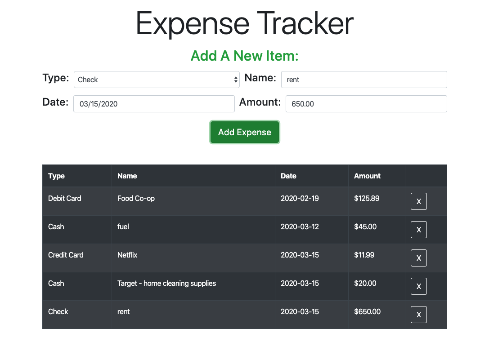

# Expense Tracker - Track Your Spending Habits

This app is a handy and simple way to keep track of how, where, when, and how much you are spending.  It was created using React Native with Bootstrap for styling.  

## Summary

This is my first React app and it posed many fun but challenging hurdles for me like learning about setting and changing state, using ES6 Javascript with arrow functions, brodening my bootstrap skills and the different ways React interacts with the DOM.  I also was able to get a good grasp of how to pass state to other components using props.



See my deployed version on Heroku - [Expense Tracker](https://reid-expense-tracker.herokuapp.com/)

## Local Installation Directions

First install the project dependencies and scripts.  In the root directory run the command:

```
npm i
```

Then to run the app on your system use the command:

```
npm run start
```

## Tech Stack Used
* React.js
* Bootstrap/React-Bootstrap


## Author 

* **Reid Muchow** - *Front-End Software Developer* - [Website](https://www.reidmuchow.com) | [LinkedIn](https://www.linkedin.com/in/reidmuchow/)
